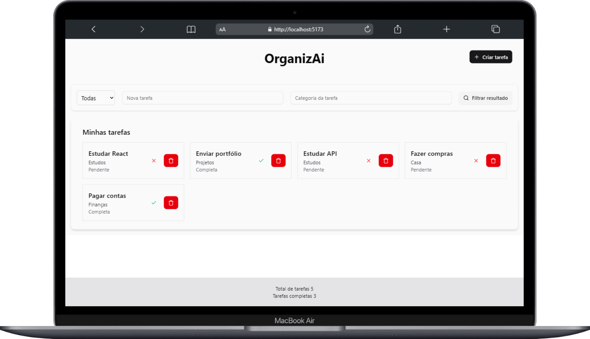

# OrganizAi
Seu mais novo aliado para organizar sua vida.

## Introdução
Um projeto em desenvolvimento para facilitar a organização das tarefas diárias.

O Organizai é um aplicativo de lista de tarefas limpo, minimalista e responsivo que ajuda você a gerenciar suas tarefas diárias com facilidade. Seja para cumprir prazos ou apenas para se lembrar de regar as plantas, este aplicativo mantém você no caminho certo.

## Funcionalidades
- ✅ Adiciona, edita e delata tarefas
- 📅 Marca as tarefas como completa ou pendente
- 📂 Organiza tarefas por categoria 
- 🌙 Alterna modo claro/escuro
- 🔄 Dados salvos localmente (localStorage ou pronto para backend)
- 📱 Mobile-first, design responsivo

## Pre-requisitos
- **Node JS**- versão 16+
- **npm ou yarn** - gerenciador de pacotes
- Git - 
- VS Code ou outro editor que suporte as tecnologias usadas
- **Editor de código** - VS Code com extensões recomendadas:
  - ESLint
  - Prettier
  - Tailwind CSS IntelliSense

## Tecnologias usadas
- TypeScript
- React 19
- Tailwind CSS
- Vite
- React Hook Form + Zod (validação de formulários)
- Shadcn UI (componentes acessíveis)
- Lucide React (ícones)
- ESLint (plugins já configurados)
- useState

## Como usar

1 - Clone o repositório
```bash
git clone https://github.com/tatyanepgoncalves/organizai
```

2. Acesse a pasta do projeto
```bash
cd organizai
```

3. Instale as dependências
```bash
npm install
```

4. Roda o projeto
```bash
npm run dev
```

Acesse `http://localhost:5173` no seu navegador.

## Estrutura de pastas
```bash
organizai/
├── public/
│   ├── organizai-modal.png
│   └── organizai.png
│  
├── src/
│   ├── components/
│   │   ├── ui/
│   │   │   ├── badge.tsx
│   │   │   ├── button.tsx
│   │   │   ├── dialog.tsx
│   │   │   ├── input.tsx
│   │   │   ├── label.tsx
│   │   │   └── pagination.tsx
│   │   │ 
│   │   ├── Footer.tsx
│   │   ├── Modal.tsx
│   │   ├── TaskList.tsx
│   │   └── TaskFilter.tsx
│   │   
│   ├── data/
│   │   └── index.ts
│   │   
│   ├── hooks/
│   │   └── useTodo.ts
│   │   
│   ├── lib/
│   │    └── utils.ts
│   ├── App.tsx
│   ├── global.css
│   ├── main.tsx
│   └── vite-env.d.ts
│   
├── gitignore
├── components.json
├── index.html
├── LICENSE
├── package.json
├── package-lock.json
├── README-Pt.md
├── README.md
├── tsconfig.json
├── tsconfig.app.json
├── tsconfig.node.json
└── vite.config.ts
```

## Link
- Confira no link: [OrganizAi](https://organizai.vercel.app/)


## Contribuindo
Sinta-se à vontade para bifurcar este repositório, abrir issues ou enviar pull requests!
Este é um projeto ideal para iniciantes — perfeito para praticar os fundamentos do React e Shadcn/Ui.

## Licença
MIT License - faça o que quiser, só não me processe.

Contruído com 💜 por **Tatyane Gonçalves**.